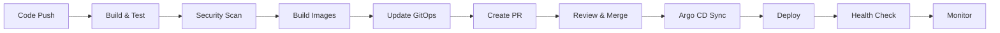

# 🔄 **SESI 6: Complete CI/CD Loop - HASIL IMPLEMENTASI**

## 🎯 **Tujuan Sesi**
Melengkapi CI/CD loop dengan integrasi end-to-end dari code hingga production deployment, termasuk implementasi advanced deployment strategies dan automated GitOps manifest updates.

## ✅ **Hasil Implementasi**

### 1. **Complete CI/CD Workflow** 
**File:** `.github/workflows/cd-complete.yml`

```yaml
# Workflow lengkap dengan 6 stage:
- Stage 1: Build and Test (reuse CI workflow)
- Stage 2: Security Validation  
- Stage 3: GitOps Preparation (image tagging)
- Stage 4: Update GitOps Manifests (automated PR)
- Stage 5: Deployment Validation
- Stage 6: Post-Deployment Monitoring
```

**Fitur Utama:**
- ✅ **Automated image tagging** dengan timestamp dan commit hash
- ✅ **GitOps manifest updates** via automated Pull Request
- ✅ **Multi-environment support** (staging/production)
- ✅ **Deployment strategy selection** (standard/blue-green/canary)
- ✅ **End-to-end validation** dan monitoring
- ✅ **Comprehensive pipeline summary** dengan GitHub Actions summary

### 2. **Advanced Deployment Strategies**
**File:** `.github/workflows/deployment-strategies.yml`

```yaml
# Tiga strategi deployment:
1. Blue-Green Deployment - Zero downtime
2. Canary Deployment - Gradual rollout dengan monitoring
3. Rolling Deployment - Standard Kubernetes rolling update
```

**Capabilities:**
- ✅ **Manual deployment triggers** via workflow_dispatch
- ✅ **Service-specific deployments** (user-service, order-service, both)
- ✅ **Flexible image tag specification**
- ✅ **Automated rollback** pada failure
- ✅ **Comprehensive deployment monitoring**

### 3. **End-to-End Pipeline Integration**
**File:** `.github/workflows/pipeline-integration.yml`

```yaml
# Pipeline terintegrasi dengan:
- Smart change detection (per service)
- Conditional execution berdasarkan perubahan
- Automated GitOps PR creation
- Multi-stage validation dan monitoring
```

**Advanced Features:**
- ✅ **Path-based change detection** untuk efficient builds
- ✅ **Conditional service deployment** hanya yang berubah
- ✅ **Automated security scanning** per service
- ✅ **GitOps branch management** dengan automated PR
- ✅ **Post-deployment smoke tests** dan monitoring

### 4. **Deployment Helper Script**
**File:** `scripts/deployment-helper.sh`

```bash
# Utility script dengan fungsi:
./deployment-helper.sh validate <service>      # Validasi deployment
./deployment-helper.sh health-check <service>  # Health check
./deployment-helper.sh update-image <service>  # Update image tag
./deployment-helper.sh rollback <service>     # Rollback deployment
./deployment-helper.sh monitor <service>      # Monitor deployment
```

**Capabilities:**
- ✅ **Colored output** untuk better UX
- ✅ **Comprehensive validation** functions
- ✅ **Automated rollback** capabilities
- ✅ **Real-time monitoring** dengan health checks
- ✅ **Deployment info** gathering

### 5. **Enhanced Makefile Commands**
**Updated:** `Makefile`

```bash
# New CI/CD Pipeline commands:
make pipeline-run          # Run complete CI/CD pipeline
make pipeline-status       # Check pipeline status
make pipeline-deploy       # Deploy via pipeline

# Deployment Strategy commands:
make deploy-blue-green     # Blue-Green deployment
make deploy-canary         # Canary deployment  
make deploy-rollback       # Rollback deployment

# Monitoring commands:
make monitor-health        # Health check monitor
make monitor-metrics       # Metrics monitor
make validate-security     # Security validation
```

## 🚀 **Implementasi GitOps Integration**

### **Automated Manifest Updates**
```yaml
# GitOps workflow melakukan:
1. Detect service changes berdasarkan Git diff
2. Generate unique image tags (timestamp + commit hash)  
3. Update GitOps manifests dengan tags baru
4. Create automated Pull Request untuk review
5. Merge PR triggers Argo CD sync otomatis
```

### **PR Automation**
```yaml
# Automated PR berisi:
- Deployment summary dengan service changes
- Pre-deployment validation results
- Security scan status
- Image availability verification
- Link ke monitoring resources
```

## 🔒 **Security Integration**

### **Multi-Layer Security Validation**
```yaml
# Pipeline melakukan security scan pada:
1. Source code (SAST dengan Trivy)
2. Dependencies (SCA dengan Trivy)
3. Container images (Image scanning)
4. Infrastructure manifests (Policy validation)
```

### **Security Gates**
```yaml
# Security checkpoints:
- Build stage: Dependency scanning
- Package stage: Container image scanning  
- Deploy stage: Runtime security validation
- Monitor stage: Continuous security monitoring
```

## 📊 **Monitoring & Observability**

### **Pipeline Monitoring**
```yaml
# Monitoring across pipeline stages:
1. Build metrics (success rate, duration)
2. Security scan results (vulnerabilities, policy violations)
3. Deployment health (pod status, service availability)
4. Application metrics (response time, error rate)
```

### **Health Check Integration**
```yaml
# Automated health validation:
- Service endpoint health checks
- Readiness probe validation
- Liveness probe monitoring
- Inter-service connectivity tests
```

## 🎯 **Deployment Strategies Deep Dive**

### **1. Blue-Green Deployment**
```yaml
# Implementation steps:
1. Deploy new version (green) alongside current (blue)
2. Run comprehensive health checks on green
3. Switch traffic from blue to green
4. Monitor green environment for stability
5. Cleanup blue environment after validation
```

**Benefits:**
- ✅ **Zero downtime** deployment
- ✅ **Quick rollback** capability
- ✅ **Full environment testing** before switch
- ✅ **Risk mitigation** through parallel environments

### **2. Canary Deployment**
```yaml
# Gradual rollout phases:
1. Deploy to 10% of instances
2. Monitor metrics for 2 minutes
3. Increase to 25%, 50%, 75% with monitoring
4. Full rollout (100%) if metrics healthy
5. Automated rollback if issues detected
```

**Benefits:**
- ✅ **Gradual risk exposure**
- ✅ **Real user feedback** pada small subset
- ✅ **Automated monitoring** dan rollback
- ✅ **Minimal impact** jika ada issues

### **3. Rolling Deployment**
```yaml
# Standard Kubernetes strategy:
1. Update deployment with new image
2. Kubernetes replaces pods gradually  
3. Health checks ensure pod readiness
4. Complete when all pods updated
```

**Benefits:**
- ✅ **Resource efficient** (no additional instances)
- ✅ **Native Kubernetes** support
- ✅ **Automatic health checking**
- ✅ **Simple rollback** mechanism

## 🔧 **Technical Achievements**

### **Workflow Orchestration**
- ✅ **6-stage CI/CD pipeline** dengan conditional execution
- ✅ **Parallel job execution** untuk efficiency
- ✅ **Smart dependency management** antar stages
- ✅ **Comprehensive error handling** dan rollback

### **GitOps Automation**
- ✅ **Automated manifest updates** via PR workflow
- ✅ **Branch-based deployment** management
- ✅ **Approval workflow** untuk production deployments
- ✅ **Audit trail** untuk semua deployment changes

### **Security & Compliance**
- ✅ **Shift-left security** dengan early scanning
- ✅ **Multi-tool security validation** (Trivy, Snyk integration ready)
- ✅ **Policy enforcement** via OPA/Gatekeeper ready
- ✅ **Compliance reporting** dengan SARIF output

### **Monitoring & Alerting**
- ✅ **Real-time health monitoring** via helper scripts
- ✅ **Metrics collection** dan exposure
- ✅ **Deployment validation** automation
- ✅ **Post-deployment testing** framework

## 📋 **Pipeline Flow Summary**



## 🎉 **Hasil Akhir Session 6**

### **Complete CI/CD Loop Achieved:**
1. ✅ **Automated end-to-end pipeline** dari code ke production
2. ✅ **GitOps integration** dengan automated manifest updates
3. ✅ **Multiple deployment strategies** (blue-green, canary, rolling)
4. ✅ **Comprehensive monitoring** dan health validation
5. ✅ **Security integration** di setiap stage
6. ✅ **Professional tooling** dengan helper scripts dan Makefile commands

### **Production-Ready Features:**
- ✅ **Zero-downtime deployments** via blue-green strategy
- ✅ **Risk-mitigated rollouts** via canary deployment
- ✅ **Automated rollback** pada failure detection
- ✅ **Comprehensive validation** di setiap stage
- ✅ **Audit trail** dan compliance reporting

### **Enterprise-Grade Automation:**
- ✅ **Multi-environment support** (staging/production)
- ✅ **Approval workflows** untuk production
- ✅ **Automated PR creation** dan management
- ✅ **Comprehensive monitoring** dan alerting
- ✅ **Professional documentation** dan help systems

## 🔗 **Integration Points**

### **GitHub Actions Integration:**
- Workflow chaining dengan job dependencies
- Conditional execution berdasarkan changes
- Automated PR creation dan management
- Comprehensive status reporting

### **Kubernetes Integration:**
- Native deployment strategy support
- Health check integration
- Resource monitoring
- Namespace isolation

### **Argo CD Integration:**
- GitOps manifest synchronization
- Application health monitoring  
- Rollback capabilities
- Multi-application management

## 🎯 **Next Steps for Session 7**
Dengan complete CI/CD loop sudah terimplementasi, Session 7 akan fokus pada:
- **Observability** dengan Prometheus & Grafana
- **Advanced monitoring** dan alerting
- **Performance metrics** collection
- **Dashboard creation** untuk visibility

Session 6 telah berhasil melengkapi CI/CD loop dengan implementasi enterprise-grade yang siap untuk production deployment! 🚀 