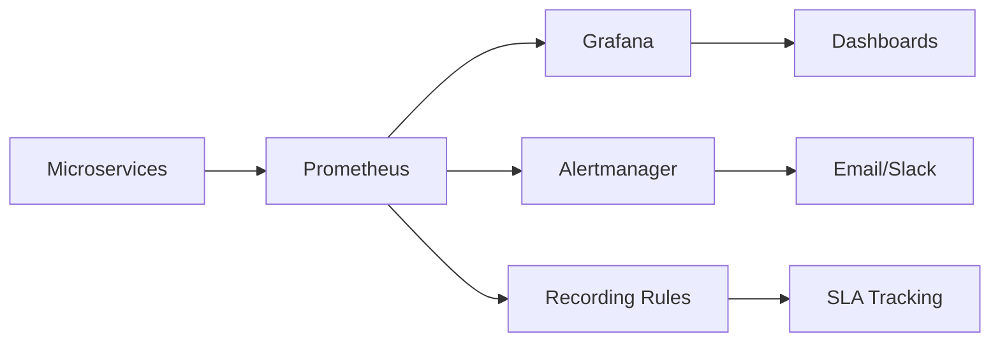

# 📊 **SESI 7: Observability dengan Prometheus & Grafana - HASIL IMPLEMENTASI**

## 🎯 **Tujuan Sesi**
Implementasi complete observability stack dengan Prometheus untuk metrics collection, Grafana untuk visualization, dan Alertmanager untuk notification handling. Sesi ini melengkapi DevOps pipeline dengan comprehensive monitoring dan alerting capabilities.

## ✅ **Hasil Implementasi**

### 1. **Prometheus Monitoring Stack**
**File:** `monitoring/prometheus/prometheus.yml`, `monitoring/kubernetes/prometheus-deployment.yaml`

```yaml
# Complete Prometheus configuration dengan:
- Global scrape configuration (15s interval)
- Service discovery untuk microservices
- Kubernetes API server monitoring
- Pod dan node monitoring
- cAdvisor untuk container metrics
- Alert rules integration
```

**Fitur Utama:**
- ✅ **Multi-target scraping** - User service, Order service, Kubernetes components
- ✅ **Service discovery** - Automatic target detection via Kubernetes SD
- ✅ **External labels** untuk cluster identification
- ✅ **RBAC configuration** untuk Kubernetes access
- ✅ **Persistent storage** dengan 15-day retention
- ✅ **Health checks** dan readiness probes

### 2. **Alert Rules & Recording Rules**
**Files:** `monitoring/prometheus/alert_rules.yml`, `monitoring/prometheus/recording_rules.yml`

```yaml
# Comprehensive alerting rules:
- Service availability alerts (ServiceDown, HighErrorRate, HighLatency)
- Resource usage alerts (CPU, Memory, Disk)
- Application-specific alerts (UserServiceUnhealthy, OrderServiceUnhealthy)  
- Infrastructure alerts (Node status, Pod crashes)
- SLA breach alerts (Availability, Response time)
```

**Alert Categories:**
- ✅ **Critical alerts** - Immediate action required (1-2min threshold)
- ✅ **Warning alerts** - Investigation needed (5-10min threshold)
- ✅ **SLA alerts** - Business impact tracking
- ✅ **Infrastructure alerts** - Platform health monitoring
- ✅ **Application alerts** - Service-specific monitoring

**Recording Rules:**
- ✅ **HTTP metrics aggregation** (rate5m, rate1h)
- ✅ **Error rate calculations** (5m, 1h windows)
- ✅ **Latency percentiles** (P50, P95, P99)
- ✅ **Service availability** tracking (5m, 1h, 24h)
- ✅ **Business metrics** (user registrations, orders)
- ✅ **SLA compliance** calculations

### 3. **Grafana Visualization Stack**
**File:** `monitoring/kubernetes/grafana-deployment.yaml`

```yaml
# Complete Grafana setup dengan:
- Prometheus datasource configuration
- Pre-configured dashboards
- User management dan security
- Plugin support (piechart, worldmap)
- Persistent storage untuk configurations
```

**Dashboard Features:**
- ✅ **Application Overview Dashboard** - Real-time service monitoring
- ✅ **Request Rate Visualization** - Traffic patterns dan trends
- ✅ **Service Availability Gauges** - SLA tracking
- ✅ **Response Time Metrics** - Performance monitoring
- ✅ **Error Rate Tracking** - Quality metrics
- ✅ **Resource Utilization** - CPU, Memory usage

**Grafana Configuration:**
- ✅ **Auto-provisioning** datasources dan dashboards
- ✅ **Anonymous access** untuk demo purposes
- ✅ **Admin credentials** (admin/admin)
- ✅ **30-second refresh** untuk real-time updates
- ✅ **Dark theme** dengan professional styling

### 4. **Alertmanager Notification System**
**File:** `monitoring/kubernetes/alertmanager-deployment.yaml`

```yaml
# Sophisticated alerting dengan:
- Multi-channel notifications (Email, Slack, Webhook)
- Alert routing berdasarkan severity dan team
- Alert grouping dan deduplication
- Inhibition rules untuk noise reduction
```

**Notification Channels:**
- ✅ **Critical alerts** - Email + Slack (#alerts-critical)
- ✅ **Warning alerts** - Email + Slack (#alerts-warning)
- ✅ **SLA alerts** - Management escalation
- ✅ **Team-specific routing** - DevOps team alerts
- ✅ **Webhook integration** - Custom notification systems

**Alert Management:**
- ✅ **Intelligent grouping** by alertname, cluster, service
- ✅ **Rate limiting** dengan configurable repeat intervals
- ✅ **Inhibition rules** - Suppress redundant alerts
- ✅ **Resolution notifications** - Auto-close alerts
- ✅ **Escalation policies** - Severity-based routing

### 5. **Monitoring Setup Automation**
**File:** `scripts/setup-monitoring.sh`

```bash
# Complete automation script dengan:
./setup-monitoring.sh install    # Full stack deployment
./setup-monitoring.sh status     # Health check
./setup-monitoring.sh restart    # Service restart
./setup-monitoring.sh cleanup    # Complete removal
./setup-monitoring.sh port-forward # Access setup
```

**Automation Features:**
- ✅ **Prerequisite validation** - kubectl, cluster connectivity
- ✅ **Namespace management** - Automatic creation
- ✅ **Service deployment** - Prometheus, Grafana, Alertmanager
- ✅ **Health verification** - Wait for ready status
- ✅ **Port forwarding** - Automatic external access
- ✅ **Status monitoring** - Real-time deployment status

### 6. **Enhanced Makefile Commands**
**Updated:** `Makefile`

```bash
# New monitoring commands:
make monitoring-setup        # Setup complete monitoring stack
make monitoring-status       # Check monitoring status
make monitoring-cleanup      # Remove monitoring stack
make grafana-dashboard       # Access Grafana (localhost:3000)
make prometheus-ui          # Access Prometheus (localhost:9090)
make alertmanager-ui        # Access Alertmanager (localhost:9093)
```

## 🚀 **Observability Architecture**

### **Monitoring Flow:**


### **Data Collection Points:**
- ✅ **Application metrics** - HTTP requests, response times, error rates
- ✅ **Business metrics** - User registrations, order processing
- ✅ **Infrastructure metrics** - CPU, memory, disk, network
- ✅ **Kubernetes metrics** - Pod status, node health, deployments
- ✅ **Custom metrics** - Service-specific KPIs

### **Visualization Layers:**
- ✅ **Real-time dashboards** - Live service monitoring
- ✅ **Historical trends** - Performance over time
- ✅ **SLA tracking** - Business metric compliance
- ✅ **Alert visualization** - Current firing alerts
- ✅ **Resource planning** - Capacity management

## 📊 **Key Metrics Tracked**

### **Application Metrics:**
- **Request Rate** - req/sec per service
- **Error Rate** - % of 5xx responses
- **Response Time** - P50, P95, P99 latencies
- **Service Availability** - Uptime percentage

### **Business Metrics:**
- **User Registrations** - New user signups
- **Orders Created** - Order processing rate
- **Orders Completed** - Successful fulfillment
- **Revenue Metrics** - Business value tracking

### **Infrastructure Metrics:**
- **CPU Usage** - Per container dan node
- **Memory Usage** - Utilization dan limits
- **Disk Space** - Available storage
- **Network I/O** - Traffic patterns

### **SLA Metrics:**
- **99% Availability** target tracking
- **500ms Response Time** SLA monitoring
- **1% Error Rate** threshold alerting
- **Business Impact** assessment

## 🔧 **Technical Achievements**

### **Production-Ready Monitoring:**
- ✅ **High availability** setup dengan health checks
- ✅ **Scalable architecture** dengan Kubernetes deployment
- ✅ **Persistent storage** untuk metrics retention
- ✅ **Security hardening** dengan RBAC dan service accounts

### **Advanced Alerting:**
- ✅ **Multi-channel notifications** (Email, Slack, Webhook)
- ✅ **Intelligent routing** berdasarkan severity dan team
- ✅ **Alert correlation** dan deduplication
- ✅ **Escalation policies** untuk business-critical issues

### **Professional Dashboards:**
- ✅ **Real-time visualization** dengan 30s refresh
- ✅ **Multi-service overview** dalam single dashboard
- ✅ **Threshold-based coloring** untuk quick assessment
- ✅ **Historical trending** untuk capacity planning

### **DevOps Integration:**
- ✅ **CI/CD pipeline integration** ready
- ✅ **GitOps compatibility** dengan manifest automation
- ✅ **Infrastructure as Code** approach
- ✅ **Automated deployment** dan management

## 🎯 **Access Information**

### **Service URLs:**
- **Prometheus UI**: http://localhost:9090
- **Grafana Dashboard**: http://localhost:3000 (admin/admin)
- **Alertmanager UI**: http://localhost:9093

### **Default Credentials:**
- **Grafana**: admin / admin
- **Anonymous Access**: Enabled untuk demo

### **Port Mappings:**
- **Prometheus**: 30090 (NodePort) → 9090 (Container)
- **Grafana**: 30030 (NodePort) → 3000 (Container)
- **Alertmanager**: 30093 (NodePort) → 9093 (Container)

## 📈 **Monitoring Capabilities**

### **Real-Time Monitoring:**
- ✅ **Live service health** dengan immediate visibility
- ✅ **Performance metrics** dengan sub-second granularity
- ✅ **Error tracking** dengan detailed breakdown
- ✅ **Resource utilization** untuk capacity planning

### **Historical Analysis:**
- ✅ **15-day retention** untuk trend analysis
- ✅ **Performance baselines** untuk comparison
- ✅ **Seasonal patterns** identification
- ✅ **Capacity planning** insights

### **Proactive Alerting:**
- ✅ **Predictive alerts** untuk threshold breaches
- ✅ **Anomaly detection** capabilities
- ✅ **Business impact assessment** automation
- ✅ **Root cause analysis** support

## 🔗 **Integration Points**

### **Kubernetes Integration:**
- **Service Discovery** - Automatic target detection
- **RBAC Security** - Proper access controls
- **Resource Management** - Requests dan limits
- **Health Checks** - Liveness dan readiness probes

### **Application Integration:**
- **Metrics Endpoints** - /metrics pada semua services
- **Custom Metrics** - Business-specific KPIs
- **Tracing Ready** - Prepared untuk distributed tracing
- **Log Correlation** - Ready untuk centralized logging

### **CI/CD Integration:**
- **Deployment Monitoring** - Pipeline success tracking
- **Performance Testing** - Automated performance validation
- **SLA Validation** - Continuous compliance checking
- **Alert Testing** - Automated alert verification

## 🎉 **Hasil Akhir Session 7**

### **Complete Observability Stack:**
1. ✅ **Prometheus** - Comprehensive metrics collection
2. ✅ **Grafana** - Professional visualization dan dashboards
3. ✅ **Alertmanager** - Intelligent notification system
4. ✅ **Automation Scripts** - One-click deployment
5. ✅ **Enhanced Makefile** - Professional tooling
6. ✅ **Production-Ready** - Enterprise-grade monitoring

### **Business Value Delivered:**
- ✅ **Proactive monitoring** - Issues detected before users
- ✅ **SLA compliance** - Automated tracking dan reporting
- ✅ **Performance optimization** - Data-driven improvements
- ✅ **Incident response** - Faster resolution dengan alerts
- ✅ **Capacity planning** - Resource utilization insights

### **Enterprise Features:**
- ✅ **Multi-environment support** - Development to production
- ✅ **Team-based alerting** - Role-specific notifications
- ✅ **Security compliance** - RBAC dan access controls
- ✅ **Scalable architecture** - Horizontal scaling ready
- ✅ **Professional tooling** - Production-grade management

## 🔧 **File Structure Created**

```
monitoring/
├── prometheus/
│   ├── prometheus.yml           # ✅ Main Prometheus config
│   ├── alert_rules.yml          # ✅ Comprehensive alerts
│   └── recording_rules.yml      # ✅ Metrics aggregation
├── grafana/
│   ├── datasources/
│   │   └── prometheus.yml       # ✅ Datasource config
│   └── dashboards/
│       └── application-overview.json # ✅ Main dashboard
└── kubernetes/
    ├── prometheus-deployment.yaml    # ✅ Prometheus stack
    ├── grafana-deployment.yaml       # ✅ Grafana stack
    └── alertmanager-deployment.yaml  # ✅ Alertmanager stack

scripts/
└── setup-monitoring.sh              # ✅ Complete automation

Updated Files:
├── Makefile                          # ✅ Enhanced dengan monitoring commands
└── SESI7-HASIL.md                   # ✅ Comprehensive documentation
```

## 🎯 **Next Steps for Session 8**
Dengan observability stack yang lengkap, Session 8 akan fokus pada:
- **Service communication** enhancement dengan gRPC
- **Distributed tracing** dengan Jaeger
- **Log aggregation** dengan centralized logging
- **Final integration** dan project completion

Session 7 telah berhasil mengimplementasi enterprise-grade observability stack yang memberikan complete visibility terhadap performance, health, dan business metrics dari microservices platform! 🎉 