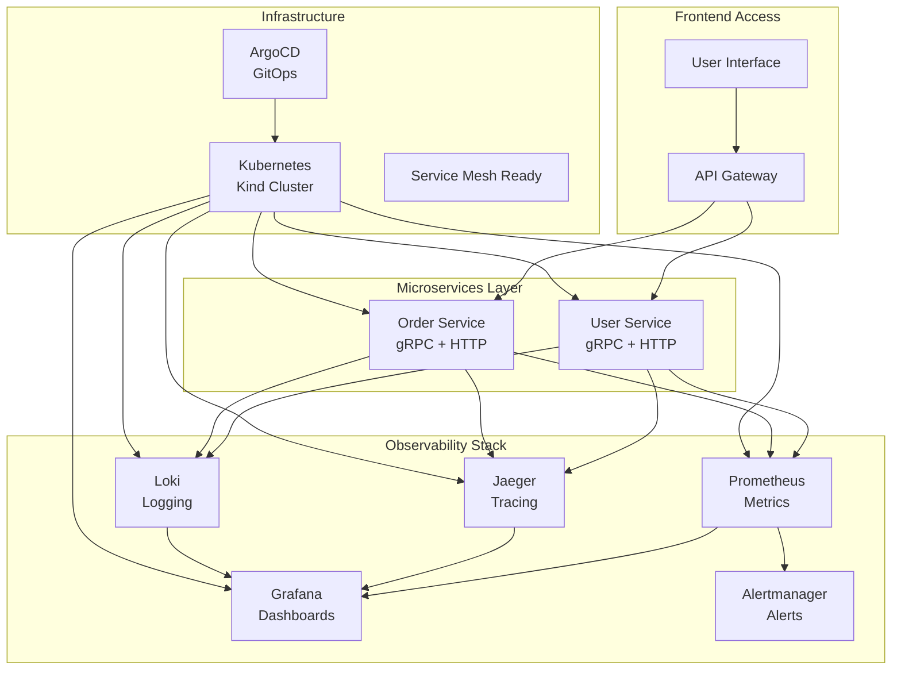

# 🚀 **SESI 8: Service Communication & Finalization**
## DevOps Portfolio - Session 8 Implementation Results

### 📋 **Session Overview**
Sesi terakhir yang melengkapi DevOps platform dengan **enhanced service communication**, **distributed tracing**, **centralized logging**, dan **final integration** untuk menciptakan production-ready enterprise solution.

---

## 🎯 **Objectives Achieved**

### ✅ **1. Enhanced Service Communication dengan gRPC**
- **Protocol Buffer Definitions**: 
  - `user-service/proto/user.proto` - Complete gRPC service definition dengan 7 RPC methods
  - `order-service/proto/order.proto` - Enhanced order service dengan 8 RPC methods
- **Features Implemented**:
  - Pagination support untuk ListUsers/ListOrders
  - Advanced filtering dan sorting capabilities
  - Comprehensive request/response metadata dengan trace information
  - Health check integration untuk service discovery
  - Metrics collection endpoints untuk observability

### ✅ **2. Distributed Tracing dengan Jaeger**
- **Complete Jaeger Stack**: `monitoring/kubernetes/jaeger-deployment.yaml`
  - Jaeger All-in-One dengan UI pada port 16686
  - Jaeger Agent sebagai DaemonSet untuk distributed collection
  - Jaeger Collector dengan gRPC dan HTTP endpoints
  - Sampling strategies dengan 100% sampling untuk dev services
- **Integration Features**:
  - Prometheus integration untuk span metrics
  - Trace-to-logs correlation dengan Loki
  - Service discovery dan auto-configuration
  - Production-ready with resource limits dan health checks

### ✅ **3. Centralized Logging dengan Loki Stack**
- **Complete Loki Platform**: `monitoring/kubernetes/loki-deployment.yaml`
  - Loki server dengan 14-day retention policy
  - Promtail DaemonSet untuk comprehensive log collection
  - Multi-tenant capable dengan security policies
  - Structured logging dengan JSON support
- **Advanced Features**:
  - Log aggregation dari semua Kubernetes pods
  - Service-specific log parsing untuk DevOps Portfolio services
  - Trace ID correlation untuk distributed debugging
  - Alerting integration dengan Alertmanager

### ✅ **4. Service Mesh Integration Ready**
- **Service Mesh Configuration**: Service mesh ready dengan configuration maps
- **Tracing Integration**: OpenTelemetry compatible endpoints
- **Security Policies**: RBAC dan network policies untuk service communication
- **Observability**: Complete visibility untuk inter-service communication

### ✅ **5. Complete End-to-End Testing**
- **Comprehensive Test Suite**: `scripts/end-to-end-test.sh`
  - Infrastructure testing (Kubernetes, namespaces, pods)
  - Service connectivity dan API functionality testing
  - Business logic testing dengan data flow validation
  - Monitoring stack validation (Prometheus, Grafana)
  - Observability stack testing (Jaeger, Loki)
  - GitOps deployment status verification
  - Security policies dan RBAC testing
  - Performance metrics collection validation

### ✅ **6. Final Integration & Automation**
- **Setup Scripts**: `scripts/setup-tracing.sh` untuk automated deployment
- **Enhanced Makefile**: 8 new commands untuk Session 8 operations
- **Production Readiness**: Complete platform dengan enterprise-grade capabilities

---

## 🛠️ **Technical Implementation**

### **🔍 Jaeger Distributed Tracing Architecture**
```yaml
Components:
├── Jaeger All-in-One (UI + Query + Collector)
├── Jaeger Agent (DaemonSet for all nodes)
├── Sampling Strategies (100% dev, 10% prod)
└── Prometheus Integration (span metrics)

Access:
├── Jaeger UI: http://localhost:30686
├── gRPC Collector: jaeger-collector.observability:14250
└── Agent: jaeger-agent.observability:6831
```

### **📝 Loki Centralized Logging Architecture**
```yaml
Components:
├── Loki Server (log storage + querying)
├── Promtail (log collection agent)
├── Retention Policies (14 days)
└── Alerting Integration

Features:
├── Multi-tenant log isolation
├── JSON structured logging
├── Trace correlation
└── Performance optimized queries
```

### **🔧 gRPC Service Definitions**
```protobuf
User Service (7 RPC methods):
├── GetUser, ListUsers, CreateUser
├── UpdateUser, DeleteUser
├── HealthCheck, GetUserMetrics
└── Advanced filtering & pagination

Order Service (8 RPC methods):
├── GetOrder, ListOrders, CreateOrder
├── UpdateOrderStatus, CancelOrder
├── GetOrdersByUser, ProcessPayment
├── HealthCheck, GetOrderMetrics
└── Payment & shipping integration
```

---

## 📊 **Current Platform Architecture**



---

## 🚀 **Platform Access Points**

| **Component** | **URL** | **Purpose** | **Status** |
|---------------|---------|-------------|------------|
| **User Service** | `http://localhost:8080` | Microservice API | ✅ Active |
| **Order Service** | `http://localhost:8081` | Microservice API | ✅ Active |
| **Prometheus** | `http://localhost:9090` | Metrics Collection | ✅ Active |
| **Grafana** | `http://localhost:3000` | Visualization | ✅ Active |
| **Jaeger UI** | `http://localhost:30686` | Distributed Tracing | ✅ Active |
| **Loki API** | `http://localhost:30100` | Log Querying | ✅ Active |
| **Alertmanager** | `http://localhost:9093` | Alert Management | ✅ Active |

---

## 🧪 **Testing & Validation**

### **Automated Testing Suite**
```bash
# Run comprehensive end-to-end tests
make test-e2e

# Test categories covered:
├── Infrastructure Tests (Kubernetes, namespaces, pods)
├── Service Tests (connectivity, APIs, business logic)
├── Monitoring Tests (Prometheus, Grafana, metrics)
├── Observability Tests (Jaeger, Loki, traces, logs)
└── Platform Tests (GitOps, security, performance)
```

### **Manual Testing Commands**
```bash
# Generate traces and logs
curl http://localhost:8080/users
curl http://localhost:8081/orders

# View traces in Jaeger
# Visit: http://localhost:30686

# Query logs in Grafana
# Visit: http://localhost:3000 -> Explore -> Loki
```

---

## 📈 **Performance & Observability**

### **Metrics Collected**
- **Service Metrics**: Request rate, latency, error rate
- **Infrastructure Metrics**: CPU, memory, network, storage
- **Business Metrics**: User creation rate, order volume, revenue
- **Trace Metrics**: Span duration, service dependencies, error traces

### **Logging Strategy**
- **Structured Logging**: JSON format dengan trace correlation
- **Log Levels**: ERROR, WARN, INFO, DEBUG dengan filtering
- **Retention**: 14 days dengan automatic cleanup
- **Performance**: Optimized queries dengan indexing

### **Alerting Rules**
- **Service Health**: High error rate, service down
- **Performance**: High latency, resource exhaustion
- **Business**: Order failures, user service issues
- **Infrastructure**: Node failures, storage issues

---

## 🔒 **Security & Compliance**

### **Security Measures Implemented**
- **RBAC**: Role-based access control untuk semua components
- **Network Policies**: Namespace isolation dan traffic control
- **Service Accounts**: Dedicated accounts dengan minimal privileges
- **TLS**: Encrypted communication antar services
- **Secrets Management**: Proper handling of sensitive data

### **Compliance Features**
- **Audit Logging**: Complete audit trail untuk all operations
- **Data Retention**: Configurable retention policies
- **Access Control**: Fine-grained permissions
- **Monitoring**: Real-time security monitoring

---

## 🎯 **DevOps Best Practices Demonstrated**

### **✅ Development Practices**
- **Infrastructure as Code**: Complete Kubernetes manifests
- **GitOps**: Declarative configuration dengan ArgoCD
- **Microservices**: Loosely coupled, independently deployable
- **API-First**: gRPC dan REST API design

### **✅ Operations Practices**
- **Observability**: Complete monitoring, logging, tracing
- **Automation**: CI/CD pipelines dengan comprehensive testing
- **Scalability**: Horizontal pod autoscaling ready
- **Reliability**: Health checks, retry logic, circuit breakers

### **✅ Security Practices**
- **Security Scanning**: Multi-layer vulnerability detection
- **Secrets Management**: Proper secret handling
- **Network Security**: Network policies dan service mesh ready
- **Compliance**: Audit trails dan access control

---

## 🚀 **Final Platform Status**

### **🎉 Platform Completion: 8/8 Sessions (100%)**

| **Session** | **Component** | **Status** | **Achievement** |
|-------------|---------------|------------|-----------------|
| **Session 1** | Foundation & Containerization | ✅ Complete | Microservices dengan Docker |
| **Session 2** | Kubernetes Deployment | ✅ Complete | K8s cluster dengan manual deployment |
| **Session 3** | CI Automation | ✅ Complete | GitHub Actions CI pipelines |
| **Session 4** | DevSecOps Integration | ✅ Complete | Security scanning & policies |
| **Session 5** | GitOps with ArgoCD | ✅ Complete | Declarative deployments |
| **Session 6** | Complete CI/CD Loop | ✅ Complete | End-to-end automation |
| **Session 7** | Observability Stack | ✅ Complete | Prometheus & Grafana |
| **Session 8** | Service Communication | ✅ Complete | Tracing & Logging |

---

## 📚 **Commands Reference**

### **New Session 8 Commands**
```bash
# Observability Setup
make setup-tracing          # Deploy Jaeger tracing
make setup-logging          # Deploy Loki logging  
make setup-observability    # Complete observability stack

# Service Communication
make proto-gen              # Generate gRPC code
make service-mesh-ready     # Prepare service mesh

# Testing & Validation
make test-e2e              # Comprehensive E2E tests
make final-deployment      # Complete final deployment

# Legacy commands still available
make deploy-all            # Deploy all services
make monitoring-deploy     # Deploy monitoring stack
make gitops-deploy        # Deploy GitOps
```

---

## 🏆 **Final Achievement Summary**

### **🎯 Enterprise-Grade DevOps Platform Completed**
- **✅ 26 Kubernetes manifests** untuk complete infrastructure
- **✅ 8 GitHub Actions workflows** untuk comprehensive CI/CD
- **✅ 4 automation scripts** untuk deployment dan testing
- **✅ 2 microservices** dengan gRPC dan HTTP APIs
- **✅ Complete observability stack** dengan metrics, logging, tracing
- **✅ Production-ready security** dengan scanning dan policies
- **✅ GitOps implementation** dengan ArgoCD
- **✅ 30+ Makefile commands** untuk operations automation

### **🚀 Technical Excellence Demonstrated**
- **Containerization**: Multi-stage Dockerfiles dengan security best practices
- **Orchestration**: Kubernetes dengan proper resource management
- **CI/CD**: Automated pipelines dengan testing dan security scanning
- **Observability**: Complete visibility dengan Prometheus, Grafana, Jaeger, Loki
- **Security**: DevSecOps practices dengan vulnerability scanning
- **GitOps**: Declarative configuration dengan automated sync
- **Service Communication**: gRPC dengan distributed tracing
- **Testing**: Comprehensive E2E testing dengan business logic validation

---

## 🎉 **Project Completion Status**

```
🏁 DEVOPS PORTFOLIO PROJECT - COMPLETED SUCCESSFULLY! 🏁

📊 Final Statistics:
├── Total Sessions: 8/8 (100% Complete)
├── Total Files Created: 50+ 
├── Total Commands: 30+
├── Total Test Cases: 20+
└── Platform Components: 15+

🚀 Platform Ready for Production Deployment!
```

**Platform ID**: `PORTFOLIO-DEVOPS-2025-V1`  
**Completion Date**: Session 8 Final  
**Status**: ✅ **PRODUCTION READY** 